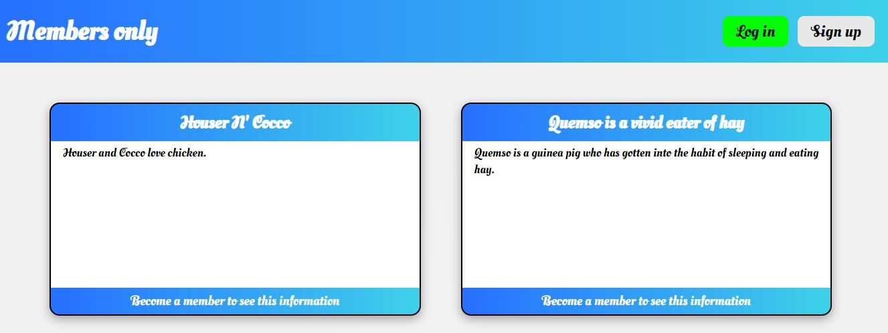
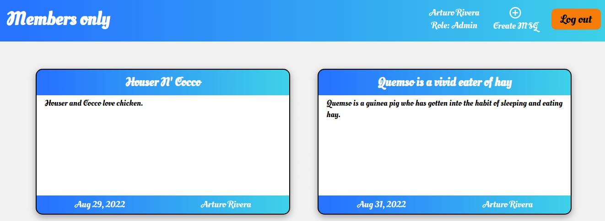
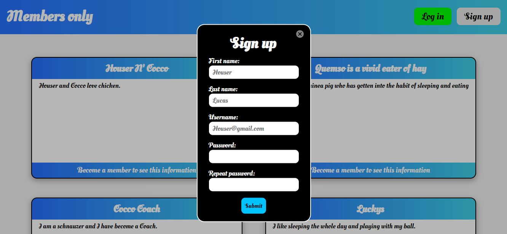
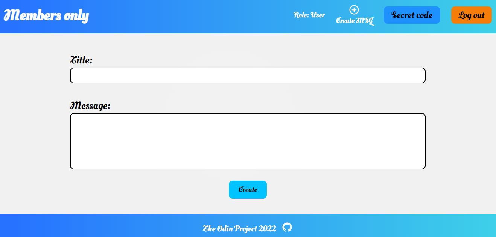

# Members Only application using EJS, Express, Node.js, Passport and MongoDB

## A project from The Odin Project curriculum to put into practice Node.js, authentication with Passport and MongoDB.

  

The application allows users to read messages from others, where message information (creation date and author) is presented according to the user's role. When creating an account it is possible to create messages that will appear in the main window, and for those who enter the secret code will have access to more information about the message. 

The application uses Passport to authenticate users and salting to protect user passwords. Users are assigned a specific role that is used by the application to conditionally render elements. On the other hand, EJS is used instead of React to create the frontend.

  

The data is validated in the BACKEND to avoid problems with symbols not considered, to avoid injection of HTML elements and to prevent users from entering an email already used.

  

When logged in, it is possible to create messages that can be read by other users.

  

